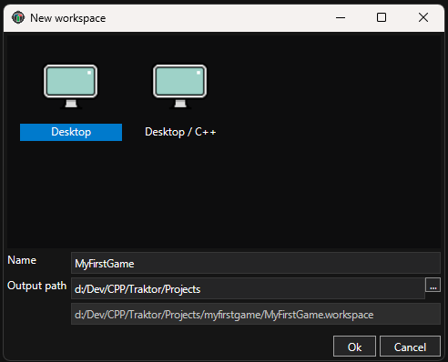

# Tutorial 00: Create Your First Project

Once you have the Traktor editor running, it's time to create your first game project. This tutorial walks you through creating a workspace and understanding the project structure.

## Creating a New Workspace

A "workspace" in Traktor is your game project. It contains all your assets, scenes, scripts, and settings.

1. **Launch the Traktor editor** - Run `Traktor.Editor.App.exe` (Windows) or `Traktor.Editor.App` (Linux)
2. **Create a new workspace** - Go to **File → New Workspace**
3. **Choose a template** - Select **Desktop** (not Desktop/C++) for a PC/Linux game project
4. **Name your project** - Enter a name like "MyFirstGame"
5. **Select a location** - Choose where to save the project on your filesystem
6. **Click OK** - The editor creates the project structure and opens it

**Note:** You'll see two template options: **Desktop** and **Desktop/C++**. For this tutorial, choose **Desktop**. The Desktop/C++ template is a more advanced option that includes C++ project files for native code development - we'll cover that in later tutorials.



## Understanding the Project Structure

After creation, your project directory looks like this:

```
MyFirstGame/
├── MyFirstGame.workspace     # Workspace configuration file
├── data/
│   ├── Source/               # Your editable assets (scenes, scripts, textures)
│   ├── Output/               # Built/cooked assets (generated by pipeline)
│   └── Temp/                 # Temporary build files (safe to delete)
└── info/                     # Additional project metadata
```

### The Source Directory

**Source** is where you work. All your scenes, materials, scripts, and textures go here. This is what you edit and version control.

This is the most important directory - it contains all your creative work in editable form. Think of it as your workshop where you build and modify everything.

### The Output Directory

**Output** contains the optimized runtime assets. The pipeline generates these automatically when you save changes. Don't edit these files manually.

The pipeline transforms your Source assets into optimized formats that the game engine can load quickly. This happens automatically in the background as you work.

### The Temp Directory

**Temp** stores intermediate build files. You can safely delete this directory; it will be regenerated when needed.

If you run into strange build issues, deleting the Temp directory often resolves them by forcing a clean rebuild.

## Understanding Asset Files

The editor uses special file extensions for asset management:

**`.xdi` files** (Database Instance) - Your actual asset data. The scene layout, the material properties, the script code. This is the "real" asset.

**`.xdm` files** (Database Metadata) - Store information about the asset: its type, its unique ID, its dependencies. The editor uses this to track relationships and build the dependency graph.

**`.xil` files** (Instance Link) - References to other assets. Instead of duplicating an asset, you create a link that points to the original. Change the original, and all links reflect that change.

**`.xgl` files** (Group Link) - References to entire folders/groups. Useful for organizing large projects with shared asset libraries.

You don't typically need to interact with these files directly - the editor manages them for you. But understanding what they are helps when working with version control systems like Git.

---

## Next Steps

Now that you have a project created and understand its structure, you're ready to create your first scene.

Continue to **[Tutorial 01: Create Your First Scene](tutorial-01-first-scene/)** to add lighting and geometry.

## See Also

- [Editor Documentation](../../editor/) - Complete editor reference
- [Database](../../editor/database/) - Understanding asset management
- [Pipeline](../../editor/pipeline/) - How assets are built
