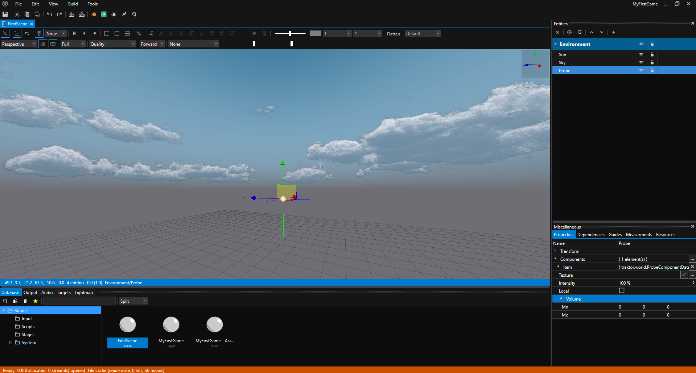
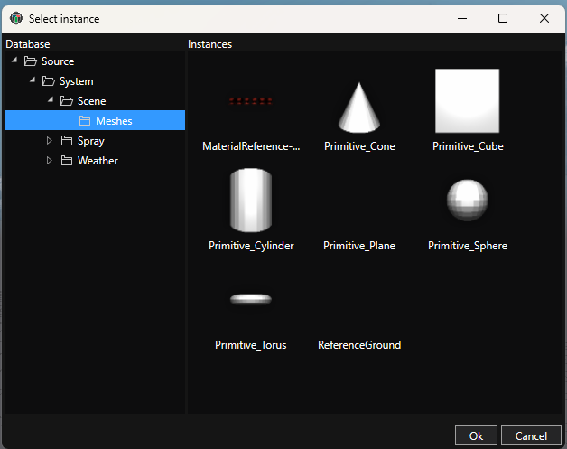
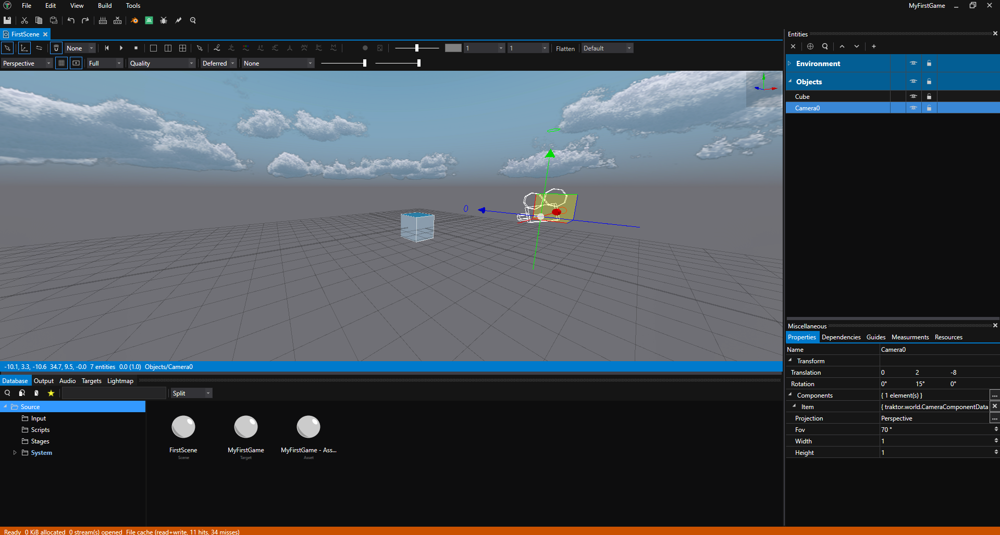
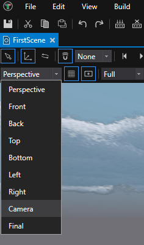
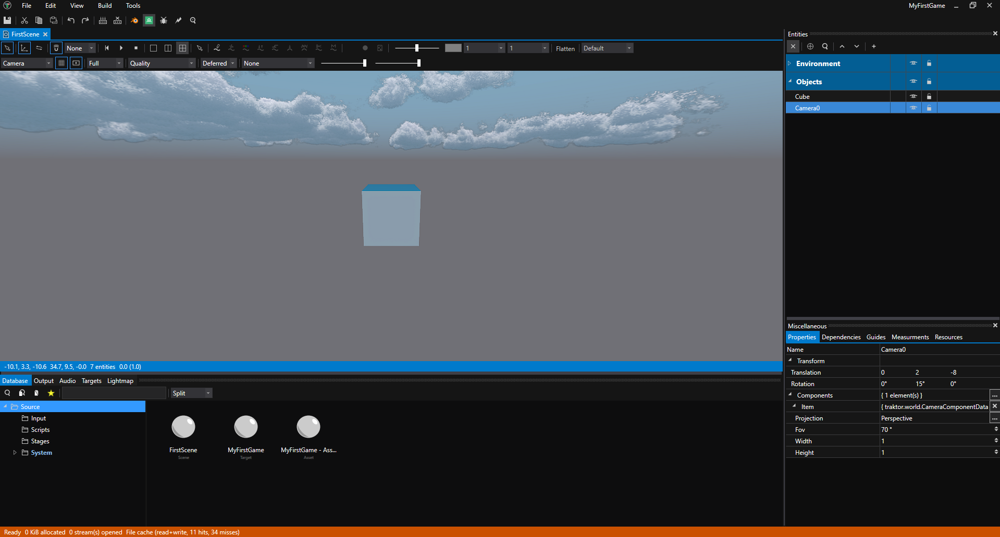

# Tutorial 01: Create Your First Scene

Now that you have a project created, let's make a simple 3D scene with lighting and geometry. By the end of this tutorial, you'll have a lit scene with a cube you can see and manipulate.

## Step 1: Create a Scene Asset

In the editor, find the **Database** panel on the left. This is where all your assets live.

1. **Create a folder** - Right-click on **Source** and select **New Group**. Name it **Scenes** (press F2 to rename)
2. **Create a scene** - Right-click the **Scenes** folder and select **New Instance**

3. **Choose the type** - Select **Scene** category on the left, then **SceneAsset** type in the content area
4. **Name it** - Enter "FirstScene" and click **OK**

The scene asset now appears in the Database, but you haven't opened it yet.

---

## Step 2: Open the Scene Editor

**Double-click FirstScene** in the Database. The first time you open a scene, the editor builds some internal assets. This takes a few seconds. You'll see a build progress dialog:

Once ready, the Scene Editor opens, showing an empty, dark viewport. Don't worry, this is normal - there's no lighting yet, so everything appears black.

---

## Step 3: Add Lighting

A scene without lights is completely black. Let's add basic lighting so you can see what you're building.

Entities in Traktor are organized into **layers** for better organization. Let's create an **Environment** layer for lights and atmosphere.

### Create the Environment Layer

1. **Create a layer** - In the Scene Editor's Entities panel (on the right), right-click and select **Add Layer**

2. **Name it** - Name the layer "Environment" (press F2 to rename)

### Add a Directional Light (Sun)

1. **Add an entity** - Right-click the Environment layer and select **Add Entity**

After adding the entity, the Environment layer may be collapsed by default. Click the arrow to expand it:

Once expanded, you'll see the unnamed entity:

2. **Name it** - Name the entity "Sun"
3. **Add the light component** - Right-click the "Sun" entity and select **Add Component**

4. **Choose component type** - In the component selection dialog, select **World** category on the left, then **LightComponentData** in the main content area, and click **OK**

5. **Configure the light type** - Click on the "Sun" entity to select it. In the Properties panel below, expand the components section and click on **LightComponentData** to view its properties.

By default, the light type is set to **Disabled**. Click the dropdown menu and select **Directional** to create a sun-like light that illuminates the entire scene.

This directional light simulates sunlight - parallel light rays coming from a single direction, illuminating everything in your scene.

### Add a Sky

1. **Add an entity** - Right-click the Environment layer and select **Add Entity**
2. **Name it** - Name the entity "Sky"
3. **Add the sky component** - With "Sky" selected, click **Add Component** in the Properties panel
4. **Choose component type** - Select **SkyComponentData** under the **weather** category.

The Sky component adds atmospheric rendering - you'll see a gradient sky in the viewport that provides ambient lighting and a visible horizon.

Your scene should now be visible with basic lighting. You'll see the sky gradient and any objects you add will be properly lit by the sun.

### (Optional) Add an Environment Probe

For more realistic reflections and improved lighting quality, you can add an environment probe:

1. **Add an entity** - Right-click the Environment layer and select **Add Entity**
2. **Name it** - Name the entity "Probe"
3. **Add the component** - Right-click the "Probe" entity and select **Add Component**, then choose **ProbeComponentData** under the world category.

With the environment probe added, you'll notice significantly better ambient lighting and reflections in your scene:

---

## Step 4: Add Geometry with a Primitive Mesh

Traktor includes primitive meshes - pre-made basic shapes like cubes, spheres, cylinders, and more. These are perfect for prototyping and learning the basics without needing to import 3D models.

Let's add a simple cube to your scene.

### Create the Objects Layer

1. **Create a layer** - Right-click in the Entities panel and select **Add Layer**
2. **Name it** - Name the layer "Objects"

### Add a Cube Entity

1. **Add an entity** - Right-click the Objects layer and select **Add Entity**
2. **Name it** - Name the entity "Cube"
3. **Add Mesh Component** - Right-click the "Cube" entity and select **Add Component**, then choose **MeshComponentData** under the **mesh** category

### Select the Cube Mesh

Now you need to tell the mesh component which mesh to display:

1. **Expand the component** - In the Properties panel, click on **MeshComponentData** to expand its properties
2. **Browse for mesh** - Click the **Browse** button next to the **Mesh** property
3. **Navigate to primitives** - In the Database browser that opens, expand **Source**, then expand **System**, then expand **Scene**, and finally select the **Meshes** group

4. **Select Cube** - Choose **Cube** from the available primitive meshes and click **OK**

You should now see a cube in your scene!

### Available Primitive Meshes

Traktor provides several primitive meshes you can use in the **Source/System/Scene/Meshes** folder:
- **Cube** - A cube/box shape
- **Sphere** - A sphere
- **Cylinder** - A cylinder
- **Cone** - A cone
- **Plane** - A flat plane
- **Torus** - A donut/torus shape

You can add more entities with mesh components and select different primitive meshes to build up your scene.

### Add a Camera

Every scene needs a camera to define the viewpoint. By convention, Traktor uses a camera named **Camera0** as the default camera.

1. **Add an entity** - Right-click the Objects layer and select **Add Entity**
2. **Name it** - Name the entity "Camera0" (note the zero at the end - this is important!)
3. **Add Camera Component** - Right-click the "Camera0" entity and select **Add Component**, then choose **CameraComponentData** under the **world** category

### Configure the Camera

The camera needs a few adjustments to work properly:

1. **Change projection** - With "Camera0" selected, expand **CameraComponentData** in the Properties panel. Find the **Projection** property and change it from **Orthographic** to **Perspective**
2. **Position the camera** - In the Camera0 entity's transform properties (at the top of the Properties panel):
   - Set **Translation** to `X: 0, Y: 2, Z: -8`
   - Set **Rotation** to `X: 0, Y: 15, Z: 0`

This positions the camera back from the cube and slightly above, with a gentle downward angle for a nice view of your scene.

### View Through the Camera

To see what your scene will look like at runtime, you can switch the Scene Editor view to use the Camera:

1. **Switch view mode** - In the Scene Editor toolbar at the top of the viewport, click the view dropdown (currently showing "Perspective")

2. **Select Camera** - Choose "Camera" from the dropdown menu

You'll now see exactly what the player will see when the game runs, using your Camera0 viewpoint:

This is the view that will be rendered when you run your scene. You can switch back to "Perspective" at any time to return to the free-moving editor camera.

---

## Navigating the Scene

Use these controls to move around your scene:

- **Hold Ctrl + Left Mouse Button** - Move the camera
- **Hold Ctrl + Right Mouse Button** - Rotate the camera
- **Mouse Wheel** - Zoom in/out
- **F Key** - Frame the selected object in the viewport

Try selecting the cube and pressing F to center it in your view, then navigate around it using the mouse controls.

---

## What's Next?

Congratulations! You've created your first lit 3D scene with geometry and a camera. Now let's make it interactive!

Continue to **[Tutorial 02: Add Your First Script](tutorial-02-first-script/)** to write Lua code that brings your cube to life with movement.

### More Ideas

**Experiment with primitives** - Add more entities with mesh components and try different primitive meshes like spheres, cylinders, cones, or torus shapes. Position them around your scene to build interesting compositions.

**Learn the editor** - Read the [Editor Documentation](../../editor/) to understand the Database, Pipeline, Scene Editor tools, and deployment.

**Explore the engine** - Dive into the [Engine Documentation](../../engine/) to learn about rendering, physics, audio, animation, and more.

## See Also

- [Scene Editor](../../editor/scene-editor/) - Detailed scene editing guide
- [Database](../../editor/database/) - Asset management
- [Scripting](../../engine/scripting/) - Adding behavior with Lua
- [World System](../../engine/world/) - Understanding entities and components
