# Tutorial 01: Create Your First Scene

Now that you have a project created, let's make a simple 3D scene with lighting and geometry. By the end of this tutorial, you'll have a lit scene with a primitive cube you can see and manipulate.

## Step 1: Create a Scene Asset

In the editor, find the **Database** panel on the left. This is where all your assets live.

1. **Create a folder** - Right-click on **Source** and select **New Group**. Name it **Scenes** (press F2 to rename)
2. **Create a scene** - Right-click the **Scenes** folder and select **New Instance**

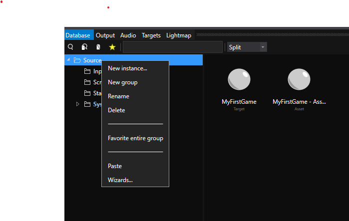

3. **Choose the type** - Select **Scene** category on the left, then **SceneAsset** type in the content area
4. **Name it** - Enter "FirstScene" and click **OK**

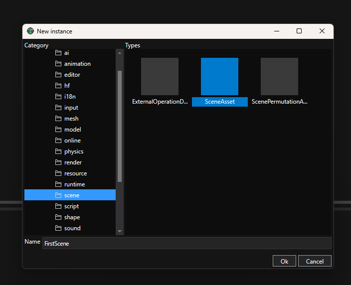

The scene asset now appears in the Database, but you haven't opened it yet.

---

## Step 2: Open the Scene Editor

**Double-click FirstScene** in the Database. The first time you open a scene, the editor builds some internal assets. This takes a few seconds. You'll see a build progress dialog:

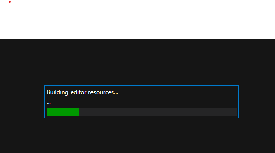

Once ready, the Scene Editor opens, showing an empty, dark viewport. Don't worry, this is normal - there's no lighting yet, so everything appears black.

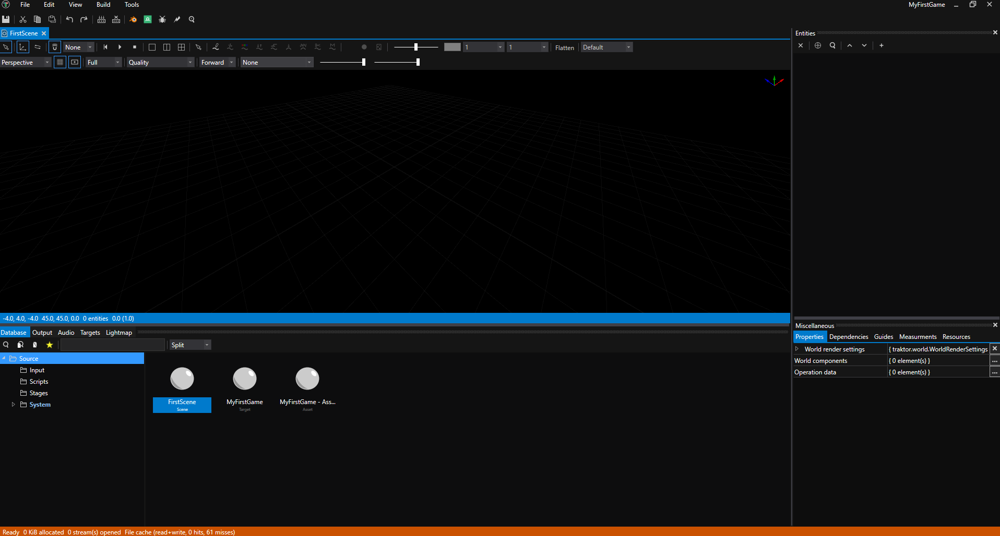

---

## Step 3: Add Lighting

A scene without lights is completely black. Let's add basic lighting so you can see what you're building.

Entities in Traktor are organized into **layers** for better organization. Let's create an **Environment** layer for lights and atmosphere.

### Create the Environment Layer

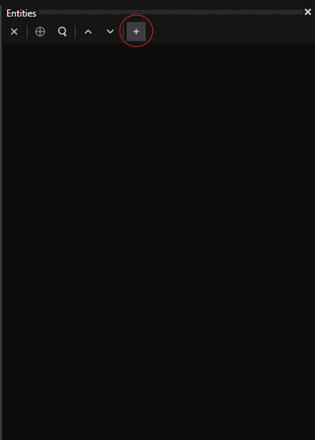

1. **Create a layer** - In the Scene Editor's Entities panel (on the right), right-click and select **Add Layer**

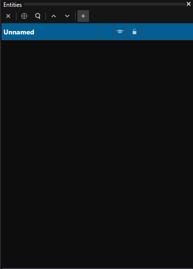

2. **Name it** - Name the layer "Environment" (press F2 to rename)

### Add a Directional Light (Sun)

1. **Add an entity** - Right-click the Environment layer and select **Add Entity**

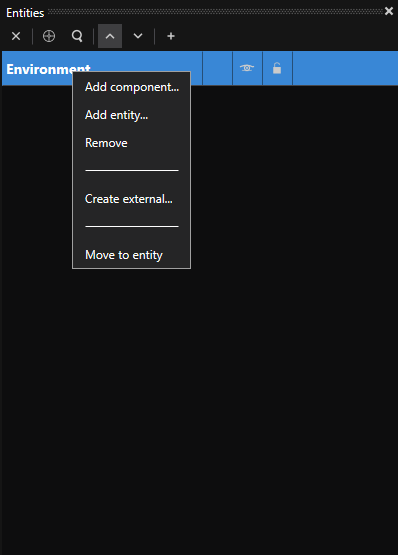

After adding the entity, the Environment layer may be collapsed by default. Click the arrow to expand it:

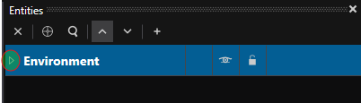

Once expanded, you'll see the unnamed entity:

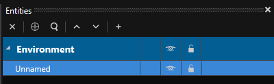

2. **Name it** - Name the entity "Sun"
3. **Add the light component** - Right-click the "Sun" entity and select **Add Component**

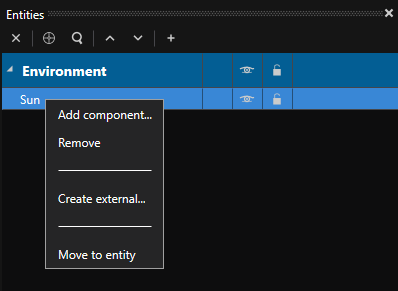

4. **Choose component type** - In the component selection dialog, select **World** category on the left, then **LightComponentData** in the main content area, and click **OK**

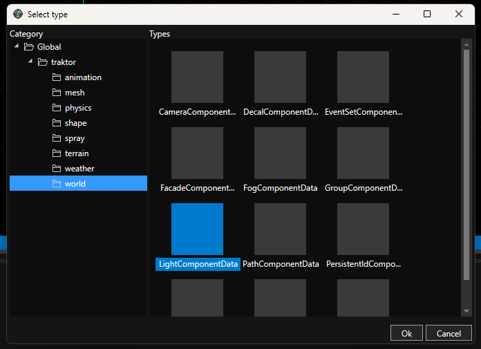

5. **Configure the light type** - Click on the "Sun" entity to select it. In the Properties panel below, expand the components section and click on **LightComponentData** to view its properties.

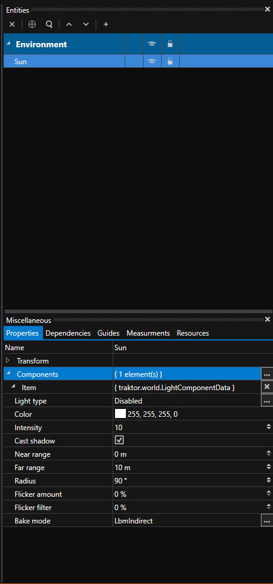

By default, the light type is set to **Disabled**. Click the dropdown menu and select **Directional** to create a sun-like light that illuminates the entire scene.

This directional light simulates sunlight - parallel light rays coming from a single direction, illuminating everything in your scene.

### Add a Sky

1. **Add an entity** - Right-click the Environment layer and select **Add Entity**
2. **Name it** - Name the entity "Sky"
3. **Add the sky component** - With "Sky" selected, click **Add Component** in the Properties panel
4. **Choose component type** - Select **Sky** component

The Sky component adds atmospheric rendering - you'll see a gradient sky in the viewport that provides ambient lighting and a visible horizon.

### (Optional) Add an Environment Probe

For more realistic reflections, you can add an environment probe:

1. **Add an entity** - Right-click the Environment layer and select **Add Entity**
2. **Name it** - Name the entity "Probe"
3. **Add the component** - Click **Add Component** and select **Environment** component

Your scene should now be visible with basic lighting. You'll see the sky gradient and any objects you add will be properly lit by the sun.

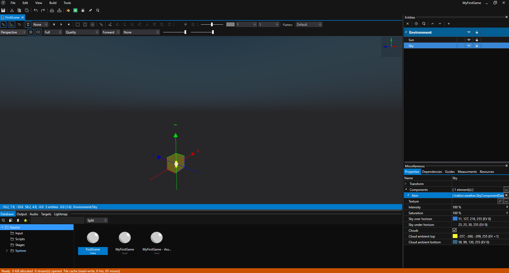

---

## Step 4: Add Geometry with Primitives

Traktor includes a primitive mesh system that lets you create basic shapes like cubes, spheres, cylinders, and more directly in the editor. These are perfect for prototyping and building simple geometry without needing external 3D modeling software.

Let's create a simple cube using primitive meshes.

### Create the Objects Layer

1. **Create a layer** - Right-click in the Entities panel and select **Add Layer**
2. **Name it** - Name the layer "Objects"

### Create a Primitive Mesh Entity

1. **Add an entity** - Right-click the Objects layer and select **Add Entity**
2. **Name it** - Name the entity "MyCube"
3. **Add Group Component** - With "MyCube" selected, click **Add Component** and select **Group** component
4. **Add Solid Component** - Click **Add Component** again and select **Solid** component

The Group component allows this entity to have children, and the Solid component tells Traktor to generate geometry from primitive shapes.

### Add a Primitive Shape

1. **Create a child entity** - Right-click "MyCube" in the entity hierarchy and select **Add Entity**
2. **Name it** - Name the child entity "Box"
3. **Add Primitive Component** - With "Box" selected, click **Add Component** and select **Primitive** component
4. **Configure the primitive**:
   - In the Primitive Component properties, set **Operation** to **Union**
   - Set **Shape** to **BoxShape**

You should now see a cube in your scene!

### Available Primitive Shapes

Traktor provides several primitive shapes you can use:
- **BoxShape** - Cube/rectangular box
- **SphereShape** - Sphere
- **CylinderShape** - Cylinder
- **ConeShape** - Cone
- **TorusShape** - Donut/torus

You can combine multiple primitive shapes in the same entity by adding more child entities with Primitive components. The **Operation** setting controls how shapes interact:
- **Union** - Combines shapes together
- **Subtract** - Cuts holes by removing one shape from another
- **Intersect** - Keeps only the overlapping areas

For now, you have a single box, but you can experiment by adding more primitive child entities with different shapes.

![TODO: Screenshot showing a simple cube created with primitives in the scene with lighting]

---

## Navigating the Scene

Use these controls to move around your scene:

- **Hold Ctrl + Left Mouse Button** - Move the camera
- **Hold Ctrl + Right Mouse Button** - Rotate the camera
- **Mouse Wheel** - Zoom in/out
- **F Key** - Frame the selected object in the viewport

Try selecting the cube and pressing F to center it in your view, then navigate around it using the mouse controls.

---

## What's Next?

Congratulations! You've created your first lit 3D scene with geometry. Here's what you can try next:

**Experiment with primitives** - Add more primitive child entities to "MyCube" with different shapes like spheres, cylinders, or cones. Try different **Operation** settings: use **Subtract** to cut holes in the cube, or **Union** to combine shapes together.

**Learn the editor** - Read the [Editor Documentation](../../editor/) to understand the Database, Pipeline, Scene Editor tools, and deployment.

**Add gameplay** - Learn [Scripting](../../engine/scripting/) to add behavior to your entities with Lua scripts.

**Explore the engine** - Dive into the [Engine Documentation](../../engine/) to learn about rendering, physics, audio, animation, and more.

## See Also

- [Scene Editor](../../editor/scene-editor/) - Detailed scene editing guide
- [Database](../../editor/database/) - Asset management
- [Scripting](../../engine/scripting/) - Adding behavior with Lua
- [World System](../../engine/world/) - Understanding entities and components
