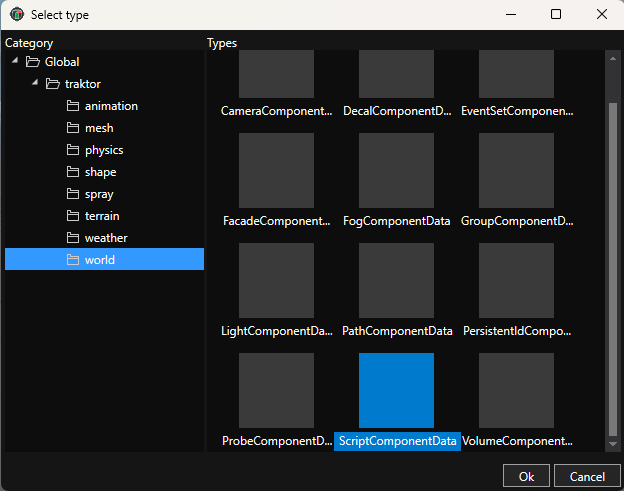
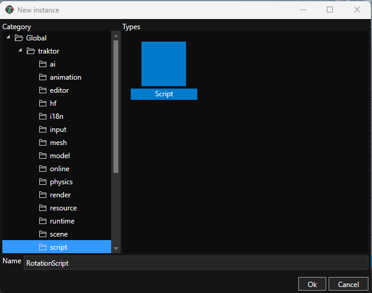
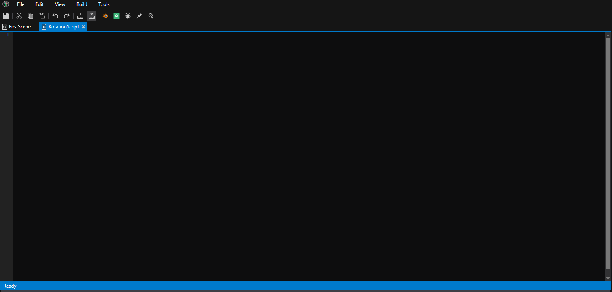
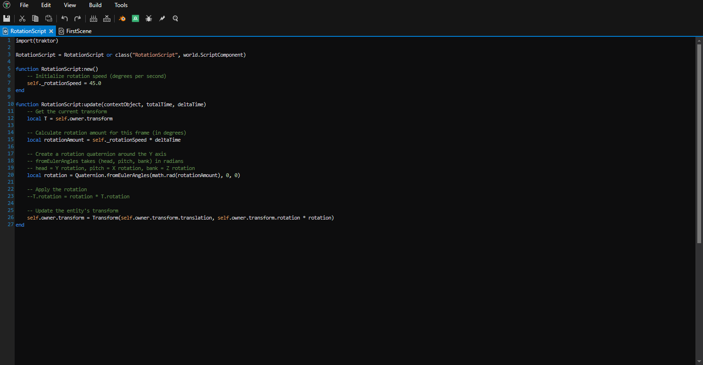
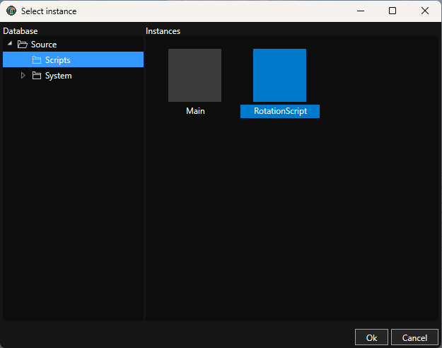
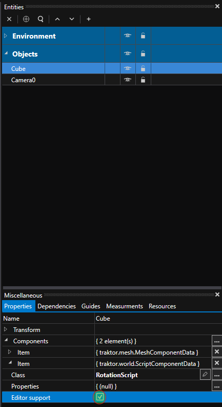
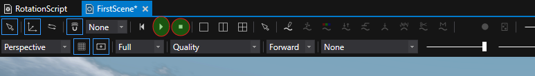
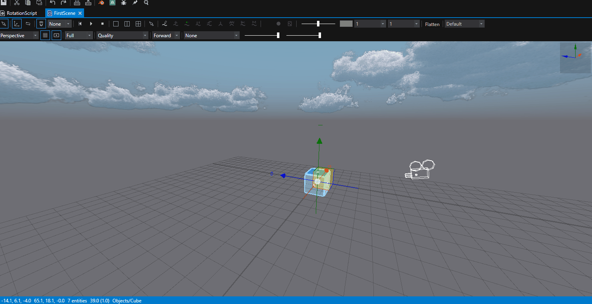

# Tutorial 02: Add Your First Script

Now that you have a scene with a cube, let's bring it to life with code. In this tutorial, you'll create a Lua script that rotates the cube, teaching you the basics of scripting in Traktor.

## About Lua Scripting

Traktor uses **Lua** as its scripting language for gameplay logic. Think of C++ as the engine's muscle - it's fast, efficient, and handles the heavy lifting like rendering and physics. Scripts are the brain - they make decisions, respond to player input, and implement game rules.

The best part? Scripts hot-reload instantly. Change your code, save the file, and see the results immediately in your running game. No recompilation, no waiting, no losing your place.

Lua is one of the easiest programming languages to learn, and it's been battle-tested in countless games from World of Warcraft to Angry Birds. Even if you've never programmed before, you'll find Lua approachable.

---

## Step 1: Add a Script Component to the Cube

First, let's attach a script component to your Cube entity so it can execute code.

1. **Select the Cube** - In the Scene Editor's Entities panel, click on your "Cube" entity under the Objects layer
2. **Add Script Component** - Right-click the "Cube" entity and select **Add Component**, then choose **ScriptComponentData** under the **world** category



The Script Component is now attached, but it doesn't have any script to run yet. Let's create one.

---

## Step 2: Create a New Script

Scripts in Traktor are assets stored in the Database, just like meshes and textures.

1. **Find the Scripts group** - In the Database panel on the left, expand **Source** and you'll see a **Scripts** group
2. **Create a new script** - Right-click the **Scripts** group and select **New Instance**
3. **Choose Script type** - In the dialog that opens:
   - Select **Script** category on the left
   - Select **Script** in the content area
   - Enter the name "RotationScript"
   - Click **OK**



You should now see "RotationScript" in the Scripts group.

---

## Step 3: Open the Script Editor

Double-click **RotationScript** in the Database to open it in the script editor.



The script editor will open with an empty script file. This is where you'll write your Lua code.

---

## Step 4: Write the Rotation Script

Now let's write a simple script that rotates the cube. Copy this code into the script editor:

```lua
import(traktor)

RotationScript = RotationScript or class("RotationScript", world.ScriptComponent)

function RotationScript:new()
    -- Initialize rotation speed (degrees per second)
    self._rotationSpeed = 45.0
end

function RotationScript:update(contextObject, totalTime, deltaTime)
    -- Get the current transform
    local T = self.owner.transform

    -- Calculate rotation amount for this frame (in degrees)
    local rotationAmount = self._rotationSpeed * deltaTime

    -- Create a rotation quaternion around the Y axis
    -- fromEulerAngles takes (head, pitch, bank) in radians
    -- head = Y rotation, pitch = X rotation, bank = Z rotation
    local rotation = Quaternion.fromEulerAngles(math.rad(rotationAmount), 0, 0)

    -- Apply the rotation
    --T.rotation = rotation * T.rotation

    -- Update the entity's transform
    self.owner.transform = Transform(self.owner.transform.translation, self.owner.transform.rotation * rotation)
end
```

**Save the script** by pressing **Ctrl+S** or going to **File → Save**.



---

## Understanding the Script

Let's break down what this code does:

**`import(traktor)`** - This is required at the start of every script. It gives you access to engine namespaces like `world`, `physics`, `render`, and more.

**`RotationScript = RotationScript or class(...)`** - This defines your script class. The pattern `ClassName = ClassName or class(...)` is important - it allows hot-reloading to work properly. Your class inherits from `world.ScriptComponent`.

**`function RotationScript:new()`** - This is the constructor, called when the entity is created. Here we initialize `self._rotationSpeed` to 45 degrees per second. Member variables are prefixed with underscore by convention.

**`function RotationScript:update(contextObject, totalTime, deltaTime)`** - This function is called every frame. The `deltaTime` parameter tells you how much time has passed since the last frame (in seconds).

**Inside update():**
- `self.owner.transform` gets the entity's current position, rotation, and scale
- We calculate how much to rotate based on speed and deltaTime
- We create a rotation quaternion using `Quaternion.fromEulerAngles(head, pitch, bank)` - in this case, just head to rotate around Y axis
- The method takes three angles in radians: **head** (Y rotation), **pitch** (X rotation), and **bank** (Z rotation)
- We apply the rotation and update the transform

---

## Step 5: Assign the Script to the Component

Now that your script is written, you need to tell the Script Component to use it:

1. **Select the Cube** - Click on your "Cube" entity in the Entities panel
2. **Expand ScriptComponentData** - In the Properties panel, click on **ScriptComponentData** to expand its properties
3. **Browse for script** - Click the **Browse** button next to the **Class** property
4. **Navigate to Scripts** - In the Database browser, expand **Source**, then select the **Scripts** group



5. **Select RotationScript** - Choose **RotationScript** and click **OK**

The script is now assigned to your Cube!

---

## Step 6: Enable Editor Support

By default, scripts don't run in the editor - they only run in the actual game. To see the rotation working while editing, you need to enable editor support:

1. **Select the Cube** - Make sure your "Cube" entity is selected
2. **Expand ScriptComponentData** - In the Properties panel, expand the script component if it's not already
3. **Enable editor support** - Check the **Enable in editor** checkbox



Now your script will run when you simulate the scene in the editor.

---

## Step 7: Simulate the Scene

To see your script in action, you can simulate the scene directly in the editor:

1. **Start simulation** - Click the **Play** button in the Scene Editor toolbar (top of the viewport)



2. **Observe the rotation** - Your cube should now be rotating smoothly around its vertical axis

3. **Stop simulation** - Click the **Stop** button to end the simulation and reset the scene to its original state

The **Play** button starts simulation mode, where all scripts with editor support enabled will run. The **Stop** button ends simulation and returns everything to the state before you pressed Play. This lets you test and iterate quickly without leaving the editor.

---

## Step 8: View from Camera (Optional)

You can also switch to Camera view to see exactly what the game camera will show:

1. Click the view dropdown in the Scene Editor toolbar
2. Select **Camera**

This shows the scene from the Camera0 entity's perspective that you created in Tutorial 01. You can switch back to Perspective view at any time to continue editing with the free-moving camera.



---

## Experiment

Try modifying the script to see instant changes:

**Change rotation speed:**
```lua
self._rotationSpeed = 90.0  -- Rotate twice as fast
```

**Rotate on a different axis:**
```lua
-- Rotate around X axis (pitch - tip forward/backward)
local rotation = Quaternion.fromEulerAngles(0, math.rad(rotationAmount), 0)

-- Rotate around Z axis (bank - roll left/right)
local rotation = Quaternion.fromEulerAngles(0, 0, math.rad(rotationAmount))
```

**Rotate in the opposite direction:**
```lua
self._rotationSpeed = -45.0  -- Negative value reverses direction
```

Every time you save the script (Ctrl+S), the changes appear immediately in the Scene Editor. This is hot-reloading in action!

---

## What's Next?

Congratulations! You've written your first script and made your cube come alive with movement. Now let's run it as a real game!

Continue to **[Tutorial 03: Deploy and Run Your Game](tutorial-03-deploy-and-run/)** to build and deploy your project to a target platform.

### More Ideas

**Try more complex scripts** - Add input handling, physics, or state machines. Check the [Scripting Documentation](../../engine/scripting/) for more examples.

**Learn the editor tools** - Explore debugging, breakpoints, and profiling in your scripts.

**Build a game** - Combine scripts, physics, audio, and more to create interactive experiences.

## See Also

- [Scripting](../../engine/scripting/) - Complete Lua scripting reference
- [World System](../../engine/world/) - Understanding entities and components
- [Scene Editor](../../editor/scene-editor/) - Scene editing tools
