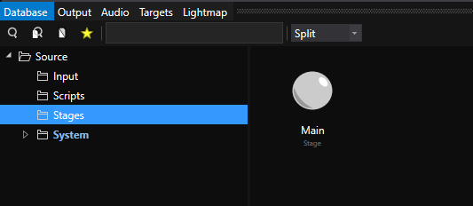
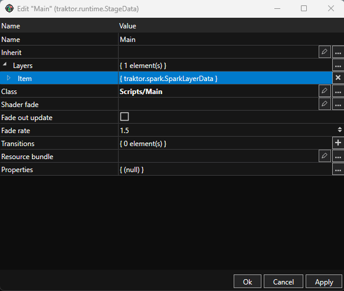
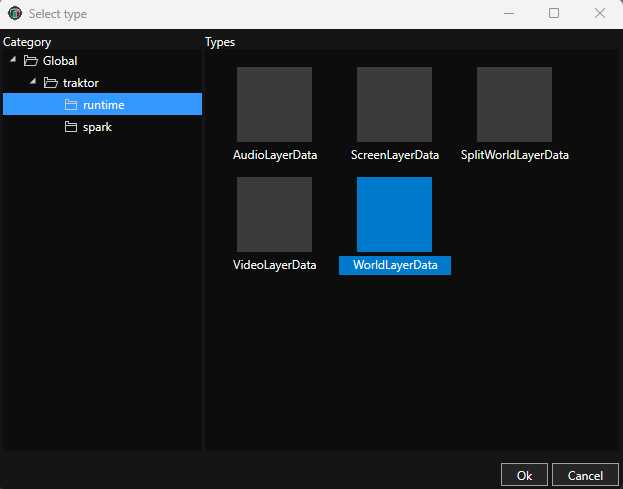
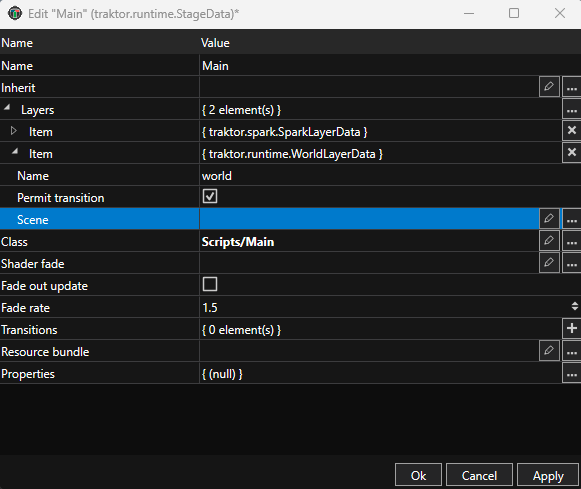
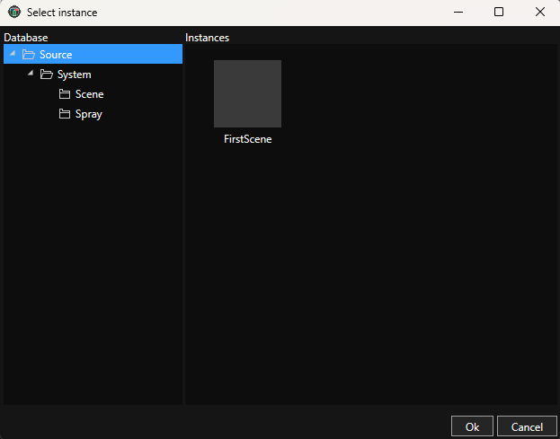
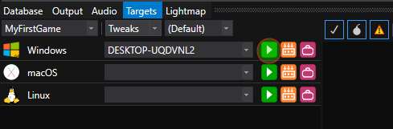
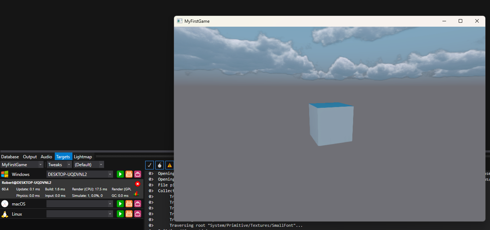
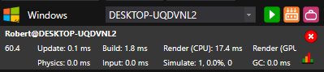
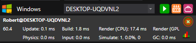

# Tutorial 03: Deploy and Run Your Game

You've built a scene with lighting, geometry, a camera, and a script. Now it's time to run it as an actual game! Unlike many other engines, Traktor uses a deployment system that builds and packages your game for different platforms. In this tutorial, you'll learn how to configure a Stage, set up your scene, and deploy your game to a target.

## About Stages and Layers

Before we can run our game, we need to understand two important concepts: **Stages** and **Layers**.

**Stages** define what happens when your game runs. Think of a Stage as a configuration that describes the game's entry point. The Stage asset tells Traktor which scenes to load, how to set up the world, and what systems to initialize. Your project comes with a default Stage called "Main" in the Stage folder.

**Layers** are the building blocks of a Stage. Each layer represents a different aspect of your game - the world, UI, effects, audio, etc. The most common layer type is the **World Layer**, which loads and manages a 3D scene. You can have multiple layers in a Stage, and they all run together.

For our simple game, we just need one World Layer that loads our FirstScene.

---

## Step 1: Open the Main Stage

Let's configure the default Stage to load our scene:

1. **Find the Stage folder** - In the Database panel, expand **Source** and you'll see a **Stage** folder
2. **Open Main stage** - Double-click the **Main** asset to open it in the Stage Editor

The Stage Editor opens, showing the current stage configuration. By default, it's empty and won't load any scenes.

---

## Step 2: Add a World Layer

Now let's add a World Layer to load our scene:

1. **Add a layer** - In the Stage Editor, right-click in the layers list and select **Add Layer**
2. **Choose World Layer** - In the dialog that opens, select **World Layer** and click **OK**

A new World Layer appears in the layers list.

---

## Step 3: Configure the World Layer

The World Layer needs to know which scene to load:

1. **Select the World Layer** - Click on the World Layer in the layers list to select it
2. **Browse for scene** - In the Properties panel on the right, find the **Scene** property and click the **Browse** button

3. **Navigate to FirstScene** - In the Database browser, expand **Source**, then expand **Scenes**, and select **FirstScene**
4. **Confirm selection** - Click **OK**

5. **Save the stage** - Press **Ctrl+S** or go to **File → Save** to save the Main stage

Your stage is now configured to load FirstScene when the game runs!

---

## Step 4: Open the Target Manager

Now we're ready to deploy and run the game. Traktor uses a **Target Manager** to build and deploy to different platforms:

1. **Switch to Targets tab** - At the bottom of the editor window, click the **Targets** tab (next to the Database tab)

The Target Manager opens, showing all available deployment targets. You should see at least one target - typically "Win64" for Windows or your local platform.

---

## Step 5: Deploy and Run

Now for the exciting part - running your game:

1. **Find your target** - In the Target Manager, locate your connected target (e.g., "Win64" or your platform)
2. **Start the game** - Click the **Play** button (▶) next to your target

**What happens now:**

- Traktor builds all your assets (scenes, meshes, scripts, textures) for the target platform
- This may take a few seconds the first time as it processes everything
- A progress indicator shows the build status
- Once the build completes, the game launches in a new window

You should see your scene running as a standalone game - the lit cube rotating exactly as it did in the editor!

---

## Step 6: Monitor Performance

While your game is running, the Target Manager shows real-time performance statistics:

You'll see metrics like:

- **Update time** - Time spent updating game logic and scripts
- **Physics time** - Time spent in physics simulation
- **Input time** - Time processing input
- **Render time** - Time spent rendering the frame
- **GC time** - Garbage collection time for Lua scripts
- **FPS** - Frames per second

These statistics help you understand performance and identify bottlenecks. For our simple rotating cube, all times should be very low and FPS should be high.

---

## Step 7: Stop the Game

When you're done testing, you can stop the game in two ways:

**Option 1: Close the game window** - Simply close the game window like any other application

**Option 2: Use the Target Manager** - Click the **Stop/Close** button in the Target Manager statistics bar

The game closes and control returns to the editor.

---

## Understanding the Deployment Pipeline

What just happened behind the scenes?

1. **Asset Building** - Traktor's pipeline processed all your source assets (scenes, meshes, scripts) and converted them to optimized runtime formats
2. **Packaging** - The built assets were packaged with the Traktor runtime and your Stage configuration
3. **Deployment** - The package was deployed to your target (in this case, your local machine)
4. **Execution** - The game launched using your Main stage, which loaded FirstScene with all its entities

The next time you click Play, Traktor only rebuilds assets that have changed - making iteration fast. Change your script, click Play, and see the results in seconds.

---

## Trying Different Targets

If you have multiple platforms configured, you can deploy to different targets:

- **Win64** - Windows 64-bit
- **Linux** - Linux builds
- **Android** - Android devices (requires Android SDK)
- **iOS** - iOS devices (requires macOS and Xcode)

Each target may have different build settings and optimizations. The Target Manager lets you test on multiple platforms without changing your project.

---

## What's Next?

Congratulations! You've built a complete game project from scratch and deployed it to a target platform. You now understand the full workflow: creating scenes, adding scripts, and deploying to run.

**Build on what you've learned** - Try adding more entities, different scripts, or new scenes. Modify your Stage to load multiple layers.

**Explore deployment options** - Learn about [Deployment](../../editor/deployment/) to understand advanced target configuration and optimization settings.

**Learn more systems** - Check out the [Engine Documentation](../../engine/) to explore physics, audio, animation, and other features you can add to your game.

**Join the community** - Share your project on [Discord](https://discord.gg/fSMrww2B7C) and see what other developers are building with Traktor.

## See Also

- [Deployment](../../editor/deployment/) - Advanced deployment and target configuration
- [Stage System](../../engine/stages/) - Understanding Stages and Layers in detail
- [Pipeline](../../editor/pipeline/) - How the asset pipeline works
- [World System](../../engine/world/) - Scenes, entities, and components
