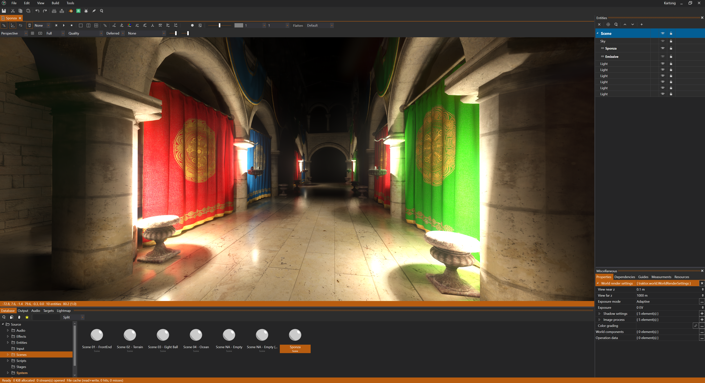

# About Traktor

Traktor is an open-source game engine written in C++ with a focus on modularity, performance, and developer workflow. It provides a complete development environment: a professional editor with hot-reloading, a modern Vulkan-based renderer with ray tracing, and a flexible architecture designed to be extended and customized.

The engine has shipped commercial games on Steam, PlayStation Network, iOS, and Mac, proving itself in real-world production. Traktor follows an "editor-first" philosophy: rather than treating the editor as an afterthought, the entire engine is built around a powerful editing workflow. Changes you make appear in your running game within milliseconds, making iteration fast and development efficient.

## What Makes Traktor Different

**Modular architecture:** Traktor is organized into clean, independent modules. Core provides fundamentals, specialized modules handle rendering, physics, audio, and scripting, and you can extend or replace systems as needed. This modularity means you're not locked into a monolithic engine where everything is tightly coupled.

**Low overhead:** The engine prioritizes minimal memory and storage footprint. Code is lean, systems are efficient, and you won't find unnecessary abstractions or bloat. Traktor aims to stay out of your way and let you build what you need.

**Modern rendering:** The Vulkan-based renderer includes advanced features: ray-traced global illumination, ambient occlusion, reflections, and shadows using ReSTIR GI for high-quality lighting. A visual shader graph makes material authoring approachable while still allowing custom GLSL when needed.

**Developer-friendly workflow:** Hot-reloading works across assets (textures, scripts, shaders, scenes) so you see changes instantly. The pipeline is highly parallelized, using all CPU cores for fast builds. One-click deployment lets you test on different platforms without manual setup.

---

## Supported Platforms

Traktor's editor runs on **Windows** and **Linux**. These are the primary development platforms with full support and regular testing.

The runtime (your actual game) has mature support for **Windows** and **Linux** as well. **Android**, **iOS**, and **macOS** builds are functional but considered experimental. They receive updates and should work, but aren't tested as rigorously as the desktop platforms. If you're targeting mobile or macOS, expect to do more testing and potentially encounter platform-specific issues.

---

## Documentation

**[Getting Started](getting-started/)** walks you through building Traktor from source, creating your first project, and understanding the basic workflow. If you're new to the engine, start here.

**[Engine Documentation](engine/)** covers the runtime systems. The code that powers your game. Learn about [architecture](engine/architecture/) and how the engine is organized, [scripting](engine/scripting/) with Lua for gameplay logic, [rendering](engine/render/) with the Vulkan-based graphics system, [physics](engine/physics/) for rigid bodies and character movement, and the [world system](engine/world/) that handles entities and components. Additional systems include [audio](engine/audio/), [animation](engine/animation/), [AI navigation](engine/ai/), [networking](engine/networking/), and more.

**[Editor Documentation](editor/)** teaches you the tools for building your game. Understand the editor interface and its dockable panels, manage assets in the Database, build 3D worlds in the Scene Editor, create materials with the visual Shader Graph, and use one-click deployment to test on any platform. The editor is where you'll spend most of your time, so mastering its workflow is essential.

---

## Community and Resources

Traktor is developed by [@apistol78](https://github.com/apistol78) and the open-source community. The source code is hosted on **[GitHub](https://github.com/apistol78/traktor)** where you can browse the codebase, report issues, and contribute improvements.

Join the **[Discord community](https://discord.gg/fSMrww2B7C)** to ask questions, share projects, get help with development, and connect with other Traktor developers. The Discord is the fastest way to get support and discuss the engine.

## License

Traktor is open source under the **Mozilla Public License 2.0 (MPL 2.0)**. This means you can use Traktor for commercial projects, modify the source code, and integrate it into your workflow. Any modifications to Traktor's source files must be made available under MPL 2.0, but your game code and assets remain yours.

## Known Limitations

Some areas are still being refined:

**Forward rendering pipeline** lacks certain reflection features available in the deferred path. If you need advanced reflections, use the deferred renderer.

**Vulkan SDK validation** may show warnings with certain SDK versions. These are typically non-critical but can be noisy during development.

**High-DPI scaling** in the editor UI is a work in progress. On high-resolution displays, interface elements may not scale perfectly.

**Mobile platforms** (Android and iOS) are functional but experimental. They receive updates but aren't tested as thoroughly as Windows and Linux, so expect platform-specific issues.
